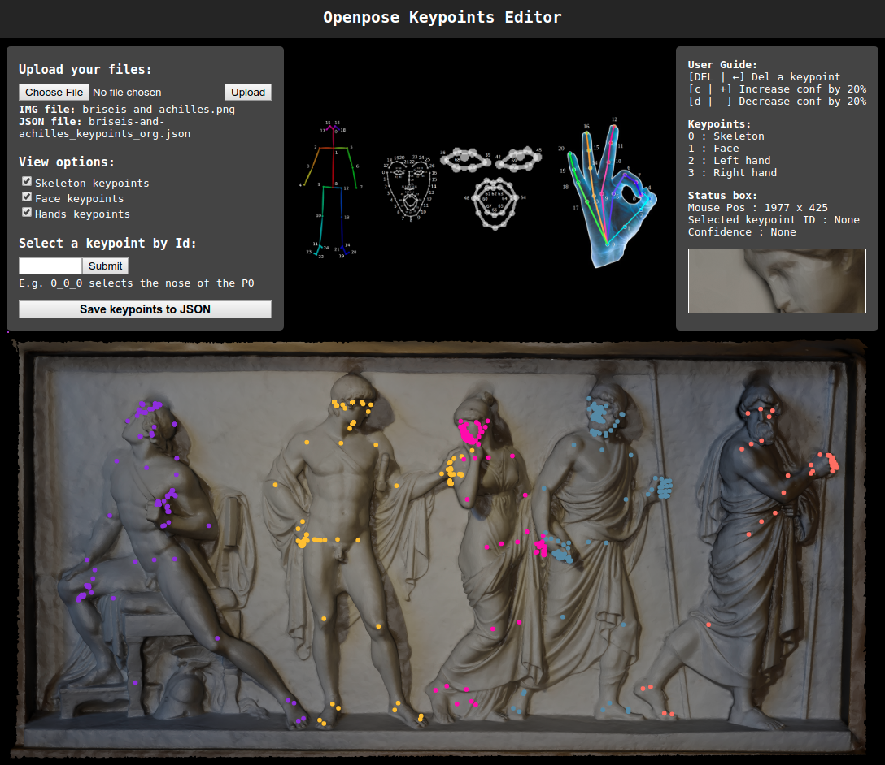

# Openpose Keypoints Editor

## A tool to load, view, correct keypoints of openpose 

<p align="center">

</p>

## Getting started: 
* clone this repo. 
* From a terminal, run
 ```
 python app.py
 ```
then open your browser and go to 127.0.0.1:5000

### Prerequisites: 
* Flask
* Python


## Description:

#### Load files
The UI enables reading an image with its openpose detection output (.json). 
Once the image file and JSON file is loaded, the tool plots a point each keyjoint. 
To see more information about each keypoint, you can use hover with your mouse.
Then, you can select a keypoint and move it around. 
Each time you move a keypoint, you change its confidence to 100%. 

#### View options
View options can choose to hide some keypoints.
These keypoints are divided as they are in openpose. 
There are skeleton keypoints, face keypoints, and (left, right) hand keypoints.

#### Search a keypoint
You can also search for a keypoint in using its id. A keypoint id is defined by the person_id, category id, keypoint number. 
* The person id can be found by hover the mouse on another keypoint of that person. 
* The keypoint category id is one of [0: skeleton, 1: face, 2: left hand, 3: right hand].
* The keypoint id can be recovered from the reference images in the top. 

#### Delete a keypoint
You can also delete a keypoint by clicking on it then pressing DEL or Backspace. 
Deleting a keypoint sets it to (0, 0) position with confidence 0%.


#### Save new JSON
After you finish correcting your keypoints, you can save a new JSON file with the new keypoints. 
The file will be named with a postfix "_corrected.json"


## Credits:

Please cite this repo in case of using it. 

* Thanks to [Etienne Balit](https://github.com/etiennebalit) for his advice. 
* Reference image credits: Openpose: https://github.com/CMU-Perceptual-Computing-Lab/openpose/blob/master/doc/output.md


## ToDos: 
* [x] search by id 
* [ ] add option to add a new skeleton (does not exist in the openpose file)
* [ ] add option to choose if changing the confidence score of dragged keypoints to 100% or not.
* [ ] add possibility to read other types of keypoint files (e.g. COCO)
* [ ] read from a folder to pass through multiple images
